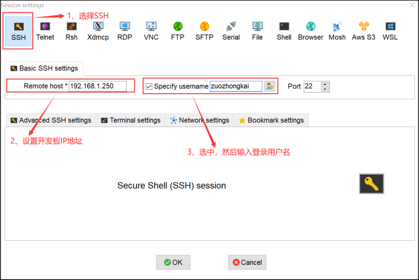

# Linux 基础

ARM Cortex-A7 使用32位指令集和32位地址空间

- 创建目录和子目录

>mkdir -p dir/dir 

- 拷贝

>cp -rfd dir_a dir_b 
d：如果源文件为链接文件，也只是把它作为链接文件复制过去，而不是复制实际文件

- 删除

>rm -rf dir_a 

- chmod：改变文件的权限

>chmod a+w .bashrc
chmod a-x .bashrc 增加或去除某种权限
>**+** 表示添加权限，**-**表示去除权限

tar xf xxx -C dir/xxx 提取文件, (-C 某个目录）

gedit 自带的图形文本编辑器

vi 配置：用户目录下添加 .vimrc文件

# Ubuntu 环境

[下载](https://releases.ubuntu.com/22.04.4/)

安装 `git vsftpd nfs-kernel-server rpcbind openssh-server xclip`

安装neovim

```sh
sudo snap install --classic nvim
```

可选工具 `neofetch ranger fzf zsh`

ranger：输入 *:set draw_borders both* 来打开边框
```sh
ranger --copy-config=all
```

- `rc.conf` - 选项设置和快捷键
- `commands.py` - 能通过 : 执行的命令
- `rifle.conf` - 指定不同类型的文件的默认打开程序。
- `scope.sh` - 文件预览相关配置

zsh 可在 .zshrc 中取消 export EDITOR='nvim' 的注释让 ranger 默认使用 nvim

命令实现了复制(yy)一个或多个存档文件，然后执行 "`:extracthere`" 解压到需要的目录

使用 7z 的用户, 可以在添加以下命令后, 选中压缩包然后执行 "`:extract`" 或通过绑定的快捷键来解压

命令允许用户将当前目录下选中的文件通过"`:compress <package name>`"命令压缩。它还支持通过当前目录名和为扩展名追加几种可能性来建议名称。

设置 *zsh* 为默认 shell

```sh
# 查看版本
zsh --version
# 设为默认
sudo chsh -s $(which zsh)
# 验证
echo $SHELL
```

使用 *wget* 安装 *oh-my-zsh* `sh -c "$(wget -O- https://install.ohmyz.sh/)"`

插件：

```sh
git clone https://github.com/zsh-users/zsh-syntax-highlighting.git ${ZSH_CUSTOM:-~/.oh-my-zsh/custom}/plugins/zsh-syntax-highlighting
git clone https://github.com/zsh-users/zsh-autosuggestions ${ZSH_CUSTOM:-~/.oh-my-zsh/custom}/plugins/zsh-autosuggestions
```

>	zsh-autosuggestions： 一个命令提示插件 (apt安装)
>	zsh-syntax-highlighting ： 一个命令语法校验插件 (apt安装)
>	web-search ： 命令行跳转浏览器搜索（自带）

在配置文件 ~/.zshrc 中 找到 **plugins** 添加插件名称，找到 **ZSH_THEME** 修改主题

1. FTP(可选)

> sudo vi /etc/vsftpd.conf

取消注释
> local_enable=YES
> write_enable=YES

2. NFS

打开
> sudo vi /etc/exports

添加
> `/home/zuozhongkai/linux/nfs *(rw,sync,no_root_squash)`

确保目录存在且文件夹有权限

3. tftp

> sudo apt install tftp-hpa tftpd-hpa

打开 /etc/default/tftpd-hpa 文件，加入如下内容

```sh
# /etc/default/tftpd-hpa

TFTP_USERNAME="tftp"
TFTP_DIRECTORY="/home/liangwencong/linux/tftpboot"
TFTP_ADDRESS=":69"
TFTP_OPTIONS="-l -c -s"
```


## 安装 交叉编译器

1. [下载地址](https://developer.arm.com/downloads/-/gnu-a) 最下面是旧版的，更旧的版本可能需要百度找了。

2. 在 x86_64 Linux hosted cross compilers 平台下选择 *arm-none-linux-gnueabihf* 编译器 *.tar.xz* 类型的压缩包


3. 下载解压到 */usr/local/arm/* (创建 arm 文件夹)

4. 添加到环境变量

- bash（默认）: 

```sh
# 打开文件
sudo vi /etc/profile
# 文件最后面添加，xxx 为解压后编译器文件夹的名字
export PATH=$PATH:/usr/local/arm/xxx/bin
```

- zsh :

在用户根目录下的 *.zshrc* 配置文件 添加 `export PATH=$PATH:/usr/local/arm/xxx/bin`

验证 `arm-none-linux-gnueabihf-gcc -v`

## VSCode和ST软件安装

1. [下载VSCode](https://code.visualstudio.com/)

下载 *.deb* 后缀的安装包

- 使用 apt 安装：进入下载目录执行 `sudo apt install ./xxx.deb` , xxx为下载的安装包名
- 使用 dpkg 安装 : `sudo dpkg -i xxx.deb`

2. 插件

>C/C++				 	这个肯定是必须的。
>C/C++ Snippets		 	C/C++重用代码块。
>C/C++ Advanced Lint 	C/C++静态检测 。
>Code Runner		 	代码运行。
>Include AutoComplete	自动头文件包含。
>Rainbow Brackets		彩虹花括号，有助于阅读代码。
>One Dark Pro			VSCode 的主题。
>GBKtoUTF8				将 GBK 转换为 UTF8。
>ARM				支持 ARM 汇编语法高亮显示。
>Chinese(Simplified)	中文环境。
>vscode-icons			VSCode 图标插件
>compareit				比较插件，可以用于比较两个文件的差异。
>DeviceTree				设备树语法插件。
>TabNine		一款 AI 自动补全插件，强烈推荐，谁用谁知道！

3. [下载STM32CubeProgrammer](https://www.st.com.cn/zh/development-tools/stm32cubeprog.html)

获取软件选择 'STM32CubePrg-Lin' 需要登录下载，

下载后解压 `unzip xxx.zip` 后运行 `./xxx.linux` 的文件

> 之后还安装了下面的库
> sudo apt-get install libusb-1.0.0-dev

4. USB DFU 以及 STLink 驱动安装

进入 STM32CubeProgrammer 安装路径下的 */Drivers/rules* 
执行 `sudo cp *.rules /etc/udev/rules.d/`
即拷贝 *.rules* 后缀的文件到 */etc/udev/rules.d/*

**验证** 插入 stlink 设备可在 */dev/* 目录下查看


## STM32MP1启动


### 一、安全启动（一般）

1. 首先 ROM 代码从选定的 Flash 设备中加载 FSBL 镜像文件(有头部信息)， FSBL 镜像就是 ROM 加载的第一个用户编写的可执行程序，一般是 TF-A 镜像。

2. FSBL 镜像加载以后需要对其进行鉴权

3. 鉴权成功，那么就会跳转到 FSBL 镜像入口地址，开始运行 FSBL 固件

### 二、串行启动

1. USB 启动

通过 USB OTG 接口来向 STM32MP1 烧写系统

2. UART 启动

通过 UART 烧写系统

### Flash 设备启动要求

	官方的 Flash 分区建议

| 尺寸          | 分区       | 描述      |
|--------------|------------|-----------|
| 256KB~512KB | fsbl     | 第一阶段启动代码，此分区存放 TF-A 或者 uboot 的 SPL 部分，<br> 如果写 A7 裸机例程的话此分区也用来存放裸机代码。 |
| 2MB         | ssbl     | 第二阶段启动代码， 一般是 uboot，如果 uboot 使用设备树的话,<br> 设备树添加到后面。 |
| 64MB        | bootfs   | boot 文件分区，可以存放如下内容：<br> · init ram 文件系统，可以将此文件系统拷贝到 RAM 中，<br> 在 linux 内核挂载正式根文件系统之前可以使用 init ram文件系统。<br> · linux 内核设备树<br> ·    linux 内核<br> · uboot 显示的启动界面<br> · uboot 发行配置文件 extlinux.conf |
| 16MB        | vendorfs | 此分区存放第三方的版权信息，确保它们不会受到任何<br> 开源许可的污染，比如 GPL V3。 |
| 768MB       | rootfs   | linux 根文件系统。 |
| 剩余空间     | userfs   | 用户自行使用的剩余空间 |

### STM23MP1 Linux系统启动过程


1. ROM 代码

> ST 自己编写的代码，ROM 代码作为第一链，首先要对 FSBL 代码进行鉴权，同样的， FSBL 以及后面的每一链都要对下一个阶段的镜像进行鉴权，直到设备系统正确启动。

2. FSBL

> FSBL 代码初始化时钟树、初始化外部 RAM 控制器，也就是 DDR。最终 FSBL 将 SSBL 加载到 DDR 里面并运行 SSBL 代码。
> 一般 FSBL 代码是 TF-A 或者 Uboot 的 SPL 代码，也可以将 FSBL 换成内核裸机代码

3. SSBL

> SSBL 代码运行在 DDR 里面，无需担心空间不够，一般是 Uboot，用来启动 Linux 内核

4. Linux 内核

> Linux 内核启动过程中会初始化板子上的各种外设

5. Linux 用户空间

> 系统启动的时候会通过 init 进程切换到用户空间，在这个过程中会初始化根文件系统里面的各种框架以及服务。

# tf-a

## 准备

~~下载st提供的STM32MP1 OpenSTLinux开发套件 <https://www.st.com.cn/zh/embedded-software/stm32mp1dev.html>~~

使用正点原子提供的包在 "01、程序源码\05、ST官方原版Linux源码" 中
	里面有Linux内核、U-boot、tf-a

解压压缩包进到tf-a目录(tf-a-stm32mp-2.2.r1-r0)执行

```sh
# 安装设备树编译相关命令
sudo apt-get install device-tree-compiler
# 解压目录下文件
tar xf tf-a-stm32mp-2.2.r1-r0.tar.gz
# 进入
cd tf-a-stm32mp-2.2.r1
# 打补丁
for p in `ls -1 ../*.patch`; do patch -p1 < $p; done
```

- 使用自己的交叉编译器
打开 Makefile.sdk， 找到`CROSS_COMPILE`，将其改为“arm-none-linux-gnueabihf-”


- 编译需要的工具：
[stm32wrapper4dbg](https://github.com/STMicroelectronics/stm32wrapper4dbg/)
`stm32image`


## 移植

### 创建自己的设备树

tf-a源码\fdts 中的

```sh
cp stm32mp157d-ed1.dts stm32mp157d-atk.dts
cp stm32mp15xx-edx.dtsi stm32mp157d-atk.dtsi
```

修改 stm32mp157d-atk.dts 中的 `stm32mp15xx-edx.dtsi` 为 `#include "stm32mp157d-atk.dtsi"`

`TFA_DEVICETREE` 配置项中添加 “stm32mp157d-atk”

### 修改电源管理和 TF 卡、 EMMC 设备树

#### stm32mp157datk.dtsi文件修改:

- 删除 pmic
- 删除vin节点，用下面内容替换

```sh
vddcore: regulator-vddcore {
	compatible = "regulator-fixed";
	regulator-name = "vddcore";
	regulator-min-microvolt = <1200000>;
	regulator-max-microvolt = <1350000>;
	regulator-off-in-suspend;
	regulator-always-on;
};

v3v3: regulator-3p3v {
	compatible = "regulator-fixed";
	regulator-name = "v3v3";
	regulator-min-microvolt = <3300000>;
	regulator-max-microvolt = <3300000>;
	regulator-off-in-suspend;
	regulator-always-on;
};

vdd: regulator-vdd {
	compatible = "regulator-fixed";
	regulator-name = "vdd";
	regulator-min-microvolt = <3300000>;
	regulator-max-microvolt = <3300000>;
	regulator-off-in-suspend;
	regulator-always-on;
};

vdd_usb: regulator-vdd-usb {
	compatible = "regulator-fixed";
	regulator-name = "vdd_usb";
	regulator-min-microvolt = <3300000>;
	regulator-max-microvolt = <3300000>;
	regulator-off-in-suspend;
	regulator-always-on;
};
```

*解释*： 
>	VDDCORE 电源，也就是 STM32MP157 的内核电源，最小为 1.2V，最大为 1.35V。
>	3.3V 电源，最小和最大都是 3.3V
>	VDD 电源，这是一个 3.3V 的电源，所以最小和最大都为 3.3V
>	VDD_USB 电源，为 3.3V，所以最小和最大都为 3.3V

- *sdmmc1* 和 *sdmmc2* 节点 替换：

```sh
&sdmmc1 {
	pinctrl-names = "default";
	pinctrl-0 = <&sdmmc1_b4_pins_a &sdmmc1_dir_pins_a>;
	st,neg-edge;
	broken-cd;
	bus-width = <4>;
	vmmc-supply = <&v3v3>;
	status = "okay";
};

&sdmmc2 {
	pinctrl-names = "default";
	pinctrl-0 = <&sdmmc2_b4_pins_a &sdmmc2_d47_pins_a>;
	non-removable;
	st,neg-edge;
	bus-width = <8>;
	vmmc-supply = <&v3v3>;
	vqmmc-supply = <&v3v3>;
	status = "okay";
};
```

- *usbotg_hs* 节点 替换

```sh
&usbotg_hs {
	phys = <&usbphyc_port1 0>;
	phy-names = "usb2-phy";
	usb-role-switch;
	status = "okay";
};

&usbphyc {
	status = "okay";
};
```


修改完成，编译 `make -f ../Makefile.sdk all` 复制 ../build/trusted 下的 *tf-a-stm32mp157d-atk-trusted.stm32*

## xxx-serialboot.stm32 文件编译

此文件用于 **串行启动** 主要用于初始化 DDR，并且提供 USB 或串口功能，目的是为了进一步将 uboot 镜像下载到 DDR 的指定位置，最终通过 uboot 来向外部 flash 设备烧写整个系统镜像。

打开 Makefile.sdk 将 EXTRA_OEMAKE_SERIAL 改为

```Makefile
EXTRA_OEMAKE_SERIAL=$(filter-out STM32MP_SDMMC=1 STM32MP_EMMC=1 STM32MP_SPI_NOR=1 STM32MP_RAW_NAND=1 STM32MP_SPI_NAND=1,$(EXTRA_OEMAKE)) STM32MP_UART_PROGRAMMER=1 STM32MP_USB_PROGRAMMER=1
```

然后

```sh
make -f ../Makefile.sdk clean
make -f ../Makefile.sdk TFA_DEVICETREE=stm32mp157d-atk TF_A_CONFIG=serialboot ELF_DEBUG_ENABLE='1' all
```

在../build/serialboot 目录下生成

# U-boot

## 准备

安装一些库

```sh
sudo apt-get install libncurses5-dev bison flex
```

解压u-boot,进到源码目录打补丁
```sh
for p in `ls -1 ../*.patch`; do patch -p1 < $p; done
```

**源码目录复制到其他地方！！！**


修改 uboot 的 Makefile 文件

```Makefile
ifeq ($(HOSTARCH),$(ARCH))
CROSS_COMPILE ?=
endif
# 在此添加下面两句话
ARCH=arm
CROSS_COMPILE=arm-none-linux-gnueabihf-
```

```sh
# 默认配置
make stm32mp15_trusted_defconfig
# 进入 configs 目录
cd configs
# 拷贝配置文件
cp stm32mp15_trusted_defconfig stm32mp15_atk_trusted_defconfig
```


## 创建默认配置设备树

```sh
# 进入 uboot 设备树目录
cd arch/arm/dts/
cp stm32mp157d-ed1.dts stm32mp157d-atk.dts
cp stm32mp15xx-edx.dtsi stm32mp157d-atk.dtsi
cp stm32mp157a-ed1-u-boot.dtsi stm32mp157d-atk-u-boot.dtsi
```

1. stm32mp157d-atk.dts 文件修改头文件引用 *stm32mp15xx-edx.dtsi* 头文件，将其改为上面创建的 *stm32mp15d-atk.dtsi*
2. *stm32mp157d-atk-u-boot.dtsi* 文件删除 21~22 行、 26~31 行和 51~53 行

如下面所示

```sh
config {
	u-boot,boot-led = "heartbeat";
	u-boot,error-led = "error";
	u-boot,mmc-env-partition = "ssbl";
x	st,fastboot-gpios = <&gpioa 13 GPIO_ACTIVE_LOW>;
x	st,stm32prog-gpios = <&gpioa 14 GPIO_ACTIVE_LOW>;
};

led {
x	red {
x		label = "error";
x		gpios = <&gpioa 13 GPIO_ACTIVE_LOW>;
x		default-state = "off";
x		status = "okay";
x		};
x	};
};

x &pmic {
x	u-boot,dm-pre-reloc;
x };
```

3. stm32mp157d-atk.dtsi 文件 adc 节点、 dac 节点、 i2c4 节点 全部删除

>  Alt + Shift + 右箭头 (可选择光标的括号中的所有内容)

> 根节点‘/’中的led 和 sd_switch节点替换成下面自己的电源管理配置

```sh
vddcore: regulator-vddcore {
	compatible = "regulator-fixed";
	regulator-name = "vddcore";
	regulator-min-microvolt = <1200000>;
	regulator-max-microvolt = <1350000>;
	regulator-always-on;
	regulator-boot-on;
};
v3v3: regulator-3p3v {
	compatible = "regulator-fixed";
	regulator-name = "v3v3";
	regulator-min-microvolt = <3300000>;
	regulator-max-microvolt = <3300000>;
	regulator-always-on;
	regulator-boot-on;
};

v1v8_audio: regulator-v1v8-audio {
	compatible = "regulator-fixed";
	regulator-name = "v1v8_audio";
	regulator-min-microvolt = <1800000>;
	regulator-max-microvolt = <1800000>;
	regulator-always-on;
	regulator-boot-on;
};

vdd: regulator-vdd {
	compatible = "regulator-fixed";
	regulator-name = "vdd";
	regulator-min-microvolt = <3300000>;
	regulator-max-microvolt = <3300000>;
	regulator-always-on;
	regulator-boot-on;
};

vdd_usb: regulator-vdd-usb {
	compatible = "regulator-fixed";
	regulator-name = "vdd_usb";
	regulator-min-microvolt = <3300000>;
	regulator-max-microvolt = <3300000>;
	regulator-always-on;
	regulator-boot-on;
};
```

4. 修改 TF 卡和 EMMC 配置

- 修改 stm32mp157d-atk.dtsi 文件，找到 sdmmc1 和 sdmmc2 节点，改为如下内容

```sh
&sdmmc1 {
	pinctrl-names = "default", "opendrain", "sleep";
	pinctrl-0 = <&sdmmc1_b4_pins_a>;
	pinctrl-1 = <&sdmmc1_b4_od_pins_a>;
	pinctrl-2 = <&sdmmc1_b4_sleep_pins_a>;
	st,neg-edge;
	broken-cd;
	bus-width = <4>;
	vmmc-supply = <&v3v3>;
	status = "okay";
};

&sdmmc2 {
	pinctrl-names = "default", "opendrain", "sleep";
	pinctrl-0 = <&sdmmc2_b4_pins_a &sdmmc2_d47_pins_a>;
	pinctrl-1 = <&sdmmc2_b4_od_pins_a &sdmmc2_d47_pins_a>;
	pinctrl-2 = <&sdmmc2_b4_sleep_pins_a &sdmmc2_d47_sleep_pins_a>;
	non-removable;
	st,neg-edge;
	bus-width = <8>;
	vmmc-supply = <&v3v3>;
	keep-power-in-suspend;
	status = "okay";
};
```


### 网络驱动修改

将网络节点添加在文件最后：

```sh
&ethernet0 {
	status = "okay";
	pinctrl-0 = <&ethernet0_rgmii_pins_a>;
	pinctrl-1 = <&ethernet0_rgmii_pins_sleep_a>;
	pinctrl-names = "default", "sleep";
	phy-mode = "rgmii-id";
	max-speed = <1000>;
	phy-handle = <&phy0>;

	mdio0 {
		#address-cells = <1>;
		#size-cells = <0>;
		compatible = "snps,dwmac-mdio";
		phy0: ethernet-phy@0 {
			reg = <0>;
		};
	};
};
```

将正点原子的 1、程序源码 → 8、模块驱动源码 → 1、 YT8511 驱动源码 → uboot 下修改方法 → phy.c 替换掉 uboot 下的/drivers/net/phy/phy.c 文件

打开 *arch/arm/dts/Makefile* 文件，找到 `dtb-$(CONFIG_STM32MP15x)` 配置项， 然后在此配置项中加入 `stm32mp157d-atk.dtb`

新建一个 `stm32mp1_alientek.sh` 脚本

```sh
# 编译 u-boot 的命令

#!/bin/bash

make distclean
make stm32mp15_atk_trusted_defconfig
make DEVICE_TREE=stm32mp157d-atk all -j12
```

赋予权限 `sudo chmod 755 stm32mp1_alientek.sh`

> V=1 表示编译 uboot 的时候输出详细的编译过程
> -j 选项来使用多线程编译

### USB OTG 设备树修改

> 在 `stm32mp157d-atk.dtsi` 文件中:

1. 根节点在根节点“/”下添加名为 `usb_phy_tuning` 的子节点, **添加在电源节点前面**

```sh
usb_phy_tuning: usb-phy-tuning {
	st,hs-dc-level = <2>;
	st,fs-rftime-tuning;
	st,hs-rftime-reduction;
	st,hs-current-trim = <15>;
	st,hs-impedance-trim = <1>;
	st,squelch-level = <3>;
	st,hs-rx-offset = <2>;
	st,no-lsfs-sc;
};
```

2. 添加 STUSB1600 I2C 子节点

添加在文件最后

```sh
&i2c1 {
	pinctrl-names = "default", "sleep";
	pinctrl-0 = <&i2c1_pins_a>;
	pinctrl-1 = <&i2c1_pins_sleep_a>;
	i2c-scl-rising-time-ns = <100>;
	i2c-scl-falling-time-ns = <7>;
	status = "okay";
	/delete-property/dmas;
	/delete-property/dma-names;

	stusb1600@28 {
		compatible = "st,stusb1600";
		reg = <0x28>;
		interrupts = <2 IRQ_TYPE_EDGE_FALLING>;
		interrupt-parent = <&gpiog>;
		pinctrl-names = "default";
		pinctrl-0 = <&stusb1600_pins_a>;
		status = "okay";
		vdd-supply = <&vin>;
		connector {
			compatible = "usb-c-connector";
			label = "USB-C";
			power-role = "dual";
			power-opmode = "default";

			port {
				con_usbotg_hs_ep: endpoint {
					remote-endpoint = <&usbotg_hs_ep>;
				};
			};
		};
	};
};
```

3. 添加 usb 接口相关节点

usbotg_hs 默认就有,修改了一下

```sh
&usbh_ehci {
	phys = <&usbphyc_port0>;
	status = "okay";
};

&usbotg_hs {
	phys = <&usbphyc_port1 0>;
	phy-names = "usb2-phy";
	usb-role-switch;
	status = "okay";

	port {
		usbotg_hs_ep: endpoint {
			remote-endpoint = <&con_usbotg_hs_ep>;
		};
	};
};

&usbphyc {
	status = "okay";
};
```

4. 在 *stm32mp157d-atk-u-boot.dtsi* 文件最后添加 `usbotg_hs` 节点

```sh
&usbotg_hs {
	u-boot,force-b-session-valid;
	hnp-srp-disable;
	/* TEMP: force peripheral for USB OTG */
	dr_mode = "peripheral";
};
```

### LCD 驱动修改

在 stm32mp157d-atk.**dts** 文件，在里面添加 LCD 相关节点信息，首先在根节点“/”下添加 panel_backlight 和 panel_rgb 节点

```sh
panel_backlight: panel-backlight {
	compatible = "gpio-backlight";
	gpios = <&gpiod 13 GPIO_ACTIVE_HIGH>;
	default-on;
	status = "okay";
};

panel_rgb: panel-rgb {
	compatible = "simple-panel";
	pinctrl-names = "default", "sleep";
	pinctrl-0 = <&ltdc_pins_b>;
	pinctrl-1 = <&ltdc_pins_sleep_b>;
	backlight = <&panel_backlight>;
	status = "okay";

	port {
		panel_in_rgb: endpoint {
			remote-endpoint = <&ltdc_ep0_out>;
		};
	};

	display-timings {
		native-mode = <&timing0>;			/* 时序信息 */
		timing0: timing0 {					/* 7 寸 1024*600 分辨率 */
			clock-frequency = <51200000>;	/* LCD 像素时钟，单位 Hz */
			hactive = <1024>;				/* LCD X 轴像素个数 */
			vactive = <600>;				/* LCD Y 轴像素个数 */
			hfront-porch = <160>;			/* LCD hfp 参数 */
			hback-porch = <140>;			/* LCD hbp 参数 */
			hsync-len = <20>;				/* LCD hspw 参数 */
			vback-porch = <20>;				/* LCD vbp 参数 */
			vfront-porch = <12>;			/* LCD vfp 参数 */
			vsync-len = <3>;				/* LCD vspw 参数 */
		};
	};
};
```

向 ltdc 节点追加一些内容

```sh
&ltdc {
	status = "okay";
	pinctrl-names = "default";
	port {
		#address-cells = <1>;
		#size-cells = <0>;

		ltdc_ep0_out: endpoint@0 {
			reg = <0>;
			remote-endpoint = <&panel_in_rgb>;
		};
	};
};
```

打开 include/configs/stm32mp1.h 添加如下宏定义：

```c
#define CONFIG_CMD_BOOTD /* 使能 boot 和 bootd 命令 */
```

## bootcmd

### bootcmd 保存着 uboot 默认命令

uboot 倒计时结束以后就会执行 bootcmd 中的命令。这些命令一般都是用来启动 Linux 内核的，比如读取 EMMC 或者 NAND Flash 中的 Linux 内核镜像文件和设备树文件到 DRAM 中，然后启动 Linux 内核。可以在 uboot 启动以后进入命令行设置 bootcmd 环境变量的值。

如果 EMMC 或者 NAND 中没有保存 bootcmd 的值，那么 uboot 就会使用默认的值，板子第一次运行 uboot 的时候都会使用默认值来设置 bootcmd 环境变量，文件 include/env_default.h有显示，可在stm32mp1.h 文件中通过设置宏
CONFIG_BOOTCOMMAND 来设置 bootcmd 的默认值。

### bootargs 保存着 uboot 传递给 Linux 内核的参数

比如指定 Linux 内核所使用的 console、指定根文件系统所在的分区等，如下面 bootargs 环境变量值：

	console=ttySTM0,115200 root=/dev/mmcblk2p3 rootwait rw

1. console

console 用来设置 linux 终端(或者叫控制台)，也就是通过什么设备来和 Linux 进行交互，是串口还是 LCD 屏幕

如果是串口的话应该是串口几等等。一般设置串口作为 Linux 终端，这样就可以在电脑上通过 MobaXterm 来和 linux 交互了。这里设置 console 为 ttySTM0，因为 linux 启动以后 STM32MP1 的串口 4 在 linux 下的设备文件就是/dev/ttySTM0，在 Linux 下，一切皆文件。

ttySTM0 后面有个“,115200”，这是设置串口的波特率， console=ttySTM0,115200 

综合起来就是设置 ttySTM0（也就是串口 4）作为 Linux 的终端，并且串口波特率设置为 115200。

2. root

root 用来设置根文件系统的位置， root=/dev/mmcblk2p3 用于指明根文件系统存放在mmcblk2 设备的分区 3 中。其中 /dev/mmcblkx(x=0~n) 表 示 mmc 设 备 ， 而 /dev/mmcblkxpy(x=0\~n,y=1\~n) 表示 mmc 设备 x 的分区 y。在 STM32MP1 开发板中/dev/mmcblk2 表示 EMMC，而/dev/mmcblk2p3 表示 EMMC 的分区 3。

rootwait 表示等待 mmc 设备初始化完成以后再挂载，否则的话 mmc 设备还没初始化完成就挂载根文件系统会出错的。 

rw 表示根文件系统是可以读写的

3. rootfstype

此选项一般配合 root 一起使用， rootfstype 用于指定根文件系统类型，如果根文件系统为 ext 格式的话此选项无所谓。如果根文件系统是 yaffs、 jffs 或 ubifs 的话就需要设置此选项，指
定根文件系统的类型。

bootargs 常设置的选项就这三个

## 图形配置

需要安装 ncurses 库：

	sudo apt-get install build-essential libncurses5-dev

执行

```sh
make stm32mp15_atk_trusted_defconfig
make menuconfig
```

## 测试

```sh
# u-boot 中的网络配置
setenv ipaddr 192.168.1.250 	//开发板 IP 地址
setenv ethaddr 00:04:9f:04:d2:35 //开发板网卡 MAC 地址
setenv gatewayip 192.168.1.1 	//开发板默认网关
setenv netmask 255.255.255.0 	//开发板子网掩码
setenv serverip 192.168.1.249 	//服务器地址，也就是 Ubuntu 地址
saveenv
```

然后 ping ubuntu虚拟机 测试

最后使用 nfs 和 tftp 下载 ubuntu虚拟机文件：

nfs C2000000 192.168.1.249:/home/zuozhongkai/linux/nfs/uImage

tftp C2000000 uImage


测试 USB OTG 功能，运行 `ums 0 mmc 1` 将 EMMC 模拟成 U 盘


# Linux内核

## 移植

安装 `sudo apt install lzop libssl-dev u-boot-tools`

解压,进到源码目录

```sh
# 打补丁
for p in `ls -1 ../*.patch`; do patch -p1 < $p; done

# 生成默认配置文件 生成 .config 配置文件
make ARCH=arm multi_v7_defconfig "fragment*.config"

# 再用两条命令打补丁
for f in `ls -1 ../fragment*.config`; do scripts/kconfig/merge_config.sh -m -r .config $f; done
yes '' | make ARCH=arm oldconfig

# 要复制一份 .config 作为默认配置文件
cp .config ./arch/arm/configs/stm32mp1_atk_defconfig
```

打完补丁的 linux 源码 linux-5.4.31 拷贝到“my_linux”目录下

Linux 内核源码目录下的主 Makefile 添加 ARCH 和 CROSS_COMPILE 这两个变量的值

```makefile
ARCH 	?= $(SUBARCH)
# 再上面这句话的下面添加，下面两行

ARCH = arm
CROSS_COMPILE = arm-none-linux-gnueabihf-
```

### 网络驱动修改

需要支持正点原子 V1.3 之后的板子的 YT8511 芯片

在 1、程序源码→8、模块驱动源码→1、 YT8511 驱动源码→linux 内核下修改方法→linux 
将 motorcomm.c 和 motorcomm_phy.h 分别拷贝到 Linux 源码下的 *drivers/net/phy* 和 *include/linux* 目录下

拷贝完成以后修改 *drivers/net/phy/Makefile* 文件最后，加上下面这句 `obj-$(CONFIG_MOTORCOMM_PHY) += motorcomm.o`

修改 *drivers/net/phy/Kconfig* 文件最后 加入：

```
config MOTORCOMM_PHY
	tristate "Motorcomm PHYs"
	---help---
		Supports the YT8010, YT8510, YT8511, YT8512 PHYs.

在下面这句话的上面加入
endif # PHYLIB
```

## 编译

创建一个名为 *stm32mp157d_atk.sh* 的编译脚本

```sh
#!/bin/sh

make distclean
make stm32mp1_atk_defconfig
make menuconfig
make uImage dtbs LOADADDR=0XC2000040 -j16
```

```sh
# 给予可执行权限，仅第一次
chmod 777 stm32mp157d_atk.sh
# 运行编译脚本
./stm32mp157d_atk.sh
```


如果提示：`"mkimage" command not found - U-Boot images will not be built` 就把 u-boot 源码目录下的 “tools/mkimage” 拿来用

Linux 源码下的 *arch/arm/boot/dts/stm32mp157d-ed1.dtb* 设备树 和 *arch/arm/boot/uImage* 镜像文件拷贝到 tftp 的文件夹

setenv bootcmd 'tftp c2000000 uImage;tftp c4000000 stm32mp157d-atk.dtb;bootm c2000000 - c4000000'


输入 make menuconfig 选上加入的驱动

```
-> Device Drivers
	-> Network device support (NETDEVICES [=y])
		-> PHY Device support and infrastructure (PHYLIB [=y])
			-> <*> Motorcomm PHYs //将 YT8511 驱动编译进内核
```

## 在Linux中添加自己的开发板

### 添加开发板对应的设备树

在 arch/arm/boot/dts/目录下执行：

```sh
cp stm32mp15xx-edx.dtsi stm32mp157d-atk.dtsi
cp stm32mp157d-ed1.dts stm32mp157d-atk.dts
```

将 stm32mp157d-atk.dts 中的 stm32mp15xx-edx.dtsi 头文件改为 `stm32mp15datk.dtsi`

#### 修改 stm32mp157d-atk.dtsi 文件

将根节点最后的三个节点（led、sd_switch、vin）替换成下面的：
```makefile
vddcore: buck1 {
	compatible = "regulator-fixed";
	regulator-name = "vddcore";
	regulator-min-microvolt = <1200000>;
	regulator-max-microvolt = <1350000>;
	regulator-always-on;
	regulator-boot-on;
};

v3v3: regulator-3p3v {
	compatible = "regulator-fixed";
	regulator-name = "v3v3";
	regulator-min-microvolt = <3300000>;
	regulator-max-microvolt = <3300000>;
	regulator-always-on;
	regulator-boot-on;
};
```

删除以下节点
adc dac i2c4 m4_rpoc timers6 usbotg_hs usbphyc_port0 usbphyc_port1

修改一下节点

```makefile
&sdmmc1 {
	pinctrl-names = "default", "opendrain", "sleep";
	pinctrl-0 = <&sdmmc1_b4_pins_a>;
	pinctrl-1 = <&sdmmc1_b4_od_pins_a>;
	pinctrl-2 = <&sdmmc1_b4_sleep_pins_a>;
	broken-cd;
	st,neg-edge;
	bus-width = <4>;
	vmmc-supply = <&v3v3>;
	status = "okay";
};

&sdmmc2 {
	pinctrl-names = "default", "opendrain", "sleep";
	pinctrl-0 = <&sdmmc2_b4_pins_a>;
	pinctrl-1 = <&sdmmc2_b4_od_pins_a>;
	pinctrl-2 = <&sdmmc2_b4_sleep_pins_a>;
	non-removable;
	st,neg-edge;
	bus-width = <8>;
	vmmc-supply = <&v3v3>;
	keep-power-in-suspend;
	status = "okay";
};
```

pwr_regulators 节点的值都改成 <&v3v3>，直接删除会打印信息有点烦。

在 dts 节点下面添加：

```makefile
&ethernet0 {
	status = "okay";
	pinctrl-0 = <&ethernet0_rgmii_pins_a>;
	pinctrl-1 = <&ethernet0_rgmii_pins_sleep_a>;
	pinctrl-names = "default", "sleep";
	phy-mode = "rgmii-id";
	max-speed = <1000>;
	phy-handle = <&phy0>;
	
	mdio0 {
		#address-cells = <1>;
		#size-cells = <0>;
		compatible = "snps,dwmac-mdio";
		phy0: ethernet-phy@0 {
			reg = <0>;
		};
	};
};
```

- 编译 stm32mp157d-atk.dts 设备树

打开 arch/arm/boot/dts/Makefile，到 `dtb-$(CONFIG_ARCH_STM32)` 配置项，在此配置项中加入:

	`stm32mp157d-atk.dtb`

### 关闭内核模块验证

编译驱动模块，然后在系统里面加载，加载的时候系统会验证模块，有时候会验证出错。比如*板子运行的系统*和*编译驱动模块所用的系统*不一致的时候，这样为我们的学习带来了很大的不便，为了方便开发，我们可以关闭内核模块验证

> make menuconfig

```
# 路径
-> Enable loadable module support (MODULES [=y])
	->Module signature verification
```

- 取消对“Module signature verification”选项
- 最后将配置项保存到 stm32mp1_atk_defconfig 里面 (*./arch/arm/configs/stm32mp1_atk_defconfig*)

### 关闭内核 log 信息时间戳

```
-> Kernel hacking
	-> printk and dmesg options
		->Show timing information on printks //取消选中
```


## 烧写系统镜像到 EMMC 里面

> 打包程在 Ubuntu 下完成

进入tftp文件夹里面有要打包的镜像

1. 新建 ext4 格式磁盘

```sh
dd if=/dev/zero of=bootfs.ext4 bs=1M count=10
mkfs.ext4 -L bootfs bootfs.ext4
```

> dd 命令创建一个名为 bootfs.ext4 的磁盘， 
> of 指定磁盘名字为“bootfs.ext4”；
> bs 指定磁盘输入/输出块大小为 1MB； 
> count 指定磁盘的块数量为 10 个。
> 因此 bootfs.ext4 只能存放不超过 10MB 的文件，如果要存放的文件总大小超过 10MB，那么就要适当调整 count 参数的大小

- 使用 mkfs.ext4 将 bootfs.ext4 磁盘格式化为 ext4 格式

2. 将系统镜像拷贝到 ext4 磁盘中

```sh
# 创建目录/mnt/bootfs
sudo mkdir /mnt/bootfs
# 用 mount 命令将 bootfs.ext4 挂载到/mnt/bootfs 目录下
sudo mount bootfs.ext4 /mnt/bootfs/
sudo cp uImage stm32mp157d-atk.dtb /mnt/bootfs/
# 拷贝完卸载
sudo umount /mnt/bootfs
```

### 烧写到 EMMC

- 将 bootfs.ext4 拷贝到以前创建的 STM32CubeProgramme 烧写目录
- 修改 flashlayout 文件 tf-a.tsv，在后面加入 bootfs.ext4 的烧写脚本
	`P	0x21	boot	System	mmc1	0x00280000	bootfs.ext4`


完成后 bootcmd 变量设置成

```sh
setenv bootcmd 'ext4load mmc 1:2 c2000000 uImage;ext4load mmc 1:2 c4000000 stm32mp157datk.dtb;bootm c2000000 - c4000000'
```

# 构建根文件系统

## 使用 busybox 构建

使用 1、例程源码->6、 BusyBox 源码->busybox-1.32.0.tar.bz2

解压后进入文件夹

busybox的顶层Makefile，添加 **ARCH** 和 **CROSS_COMPILE** 的值

```
164 CROSS_COMPILE ?= /usr/local/arm/gcc-arm-9.2-2019.12-x86_64-arm-none-linux-gnueabihf/bin/arm-none-linux-gnueabihf-
......
190 ARCH ?= arm

```

 CORSS_COMPILE 使用了绝对路径！主要是为了防止编译出错

### busybox 中文字符支持

打开文件 *busybox-1.32.0/libbb/printable_string.c*，找到函数 printable_string2

```c
// 注释掉19、20行
/* if (c >= 0x7f)
		break; */

/* 修改下面代码 23行*/
/* if (c < ' ' || c >= 0x7f) */
	if( c < ' ')
		*d = '?';
```

打开文件 *busybox-1.32.0/libbb/unicode.c*

```c
/* 修改下面一行代码 */
/* *d++ = (c >= ' ' && c < 0x7f) ? c : '?'; 1028行*/
*d++ = (c >= ' ') ? c : '?';
/* 修改下面一行代码 */
/* if (c < ' ' || c >= 0x7f) 1036行*/
if(c < ' ')
	*d = '?'
```

### 配置 busyboox

 busybox 的配置选项
 - defconfig，缺省配置，也就是默认配置选项
 - allyesconfig，全选配置，也就是选中 busybox 的所有功能
 - allnoconfig，最小配置
 
 因此使用如下命令先使用默认配置来配置一下 busybox：
 ```sh
 make defconfig
 ```

 打开图形化配置界面 `make menuconfig`

 ```
	-> Settings
		-> Build static binary (no shared libs)
 ```

 用来决定是静态编译是动态编译(不选择，使用动态编译，采用静态编译 DNS 会出问题！无法进行域名解析)

```
-> Settings
	-> vi-style line editing commands
```

选择

```
-> Linux Module Utilities
	-> Simplified modutils
```

不选

```
-> Linux System Utilities
	-> mdev (17 kb) //确保下面的全部选中，默认都是选中的
```

都选择

```
-> Settings
	-> Support Unicode //选中
		-> Check $LC_ALL, $LC_CTYPE and $LANG environment variables //选中
```

使能 busybox 的 unicode 编码以支持中文

在配置主界面上，选中“Save Configuration to an Alternate File” 保存一下配置文件

Busybox 的默认配置文件都是保存到 configs 目录下，配置文件的名字后缀必须是 *_defconfig*， 这里设置 *./configs/stm32mp1_atk_defconfig* 

以后要想使用自己的配置文件，直接输入 `make stm32mp1_atk_defconfig`

- **编译 busybox**

```sh
make
make install CONFIG_PREFIX=/home/xemao/linux/nfs/rootfs
```

### 完善根文件系统

#### 向根文件系统添加lib库

1. 向 rootfs 的 */lib* 目录添加库文件

```sh
# 在 rootfs 文件夹下创建 lib 文件夹
mkdir lib
cd /usr/local/arm/gcc-arm-9.2-2019.12-x86_64-arm-none-linux-gnueabihf/arm-none-linux-gnueabihf/libc/lib
# 将此目录下所有的*so*文件都拷贝到 rootfs/lib 目录中，-d 表示拷贝符号链接
cp *so* ~/linux/nfs/rootfs/lib/ -d

# 将 rootfs/lib 中的 ld-linux-armhf.so.3 文件删除掉
rm ld-linux-armhf.so.3

# 重新拷贝 ld-linux-armhf.so.3
cp ld-linux-armhf.so.3 ~/linux/nfs/rootfs/lib/

cd /usr/local/arm/gcc-arm-9.2-2019.12-x86_64-arm-none-linux-gnueabihf/arm-none-linux-gnueabihf/lib
cp *so* *.a ~/linux/nfs/rootfs/lib/ -d
```

2. 向 rootfs 的“usr/lib”目录添加库文件


usr 目录下创建一个名为 lib 的目录

```sh
cd /usr/local/arm/gcc-arm-9.2-2019.12-x86_64-arm-none-linux-gnueabihf/arm-none-linux-gnueabihf/libc/usr/lib
cp *so* *.a ~/linux/nfs/rootfs/usr/lib/ -d
```

```sh
cd rootfs //进入根文件系统目录
du ./lib ./usr/lib/ -sh //查看 lib 和 usr/lib 这两个目录的大小
```

这两个文件的大小分别为 158MB 和 89MB，加起来就是 158+89=247MB

创建其他文件夹，如 dev、 proc、 mnt、 sys、 tmp、 etc 和 root 等

### 继续完善根文件系统

前面根据 busybox 生成的根文件系统修改的只是可以运行，下面就进一步完善。

1.  创建 */etc/init.d/rcS* 文件

> *rcS* 是个 shell 脚本， Linux 内核启动以后需要启动一些服务，而 *rcS* 就是规定启动哪些文件的脚本文件。

- 在 rootfs 中创建 */etc/init.d/rcS* 文件，然后在 *rcS* 中输入下面内容

```sh
#!/bin/sh

PATH=/sbin:/bin:/usr/sbin:/usr/bin:$PATH
LD_LIBRARY_PATH=$LD_LIBRARY_PATH:/lib:/usr/lib
export PATH LD_LIBRARY_PATH

mount -a
mkdir /dev/pts
mount -t devpts devpts /dev/pts

echo /sbin/mdev > /proc/sys/kernel/hotplug
mdev -s
```

- **PATH** 环境变量保存着可执行文件可能存在的目录
- **LD_LIBRARY_PATH** 环境变量保存着库文件所在的目录
- *export* 来导出上面这些环境变量，相当于声明一些“*全局变量*”
- *mount* 命令来挂载所有的文件系统，这些文件系统由文件 */etc/fstab* 来指定
- 创建目录 */dev/pts*，然后将 devpts 挂载到 */dev/pts* 目录中
-  mdev 来管理热插拔设备
	>关于 mdev 的详细内容可以参考 busybox 中的 *docs/mdev.txt* 文档

**给予 /ec/init.d/rcS 可执行权限**
> chmod 777 rcS

2. 创建 */etc/fstab* 文件

在 rootfs 中创建 */etc/fstab* 文件， fstab 在 Linux 开机以后自动配置哪些需要自动挂载的分区，
格式如下

> *`file system`* *`mount point`* *`type`* *`options`* *`dump`* *`pass`*

`file system`：要挂载的特殊的设备，也可以是块设备，比如/dev/sda 等等。

`mount point`：挂载点。

`type`：文件系统类型，比如 ext2、 ext3、 proc、 romfs、 tmpfs 等等。

`options`：挂载选项，在 Ubuntu 中输入 `man mount` 命令可以查看具体的选项。一般使用 defaults，也就是默认选项， defaults 包含了 rw、 suid、 dev、 exec、 auto、 nouser 和 async。

`dump`：为 1 的话表示允许备份，为 0 不备份，一般不备份，因此设置为 0。

`pass`：磁盘检查设置，为 0 表示不检查。根目录 **/** 设置为 1，其他的都不能设置为 1，其他的分区从 2 开始。一般不在 fstab 中挂载根目录，因此这里一般设置为 0。

按照上述格式，在 fstab 文件中输入

```
#<file system> <mount point>   <type>	<options> <dump> <pass>
proc		/proc		proc	defaults	0	0
tmpfs		/tmp		tmpfs	defaults	0	0
sysfs		/sys		sysfs	defaults	0	0
```

3. 创建 */etc/inittab* 文件

inittab 的详细内容可以参考 busybox 下的文件 *examples/inittab*。 

init 程序会读取 */etc/inittab* 这个文件， inittab 由若干条指令组成。每条指令的结构都是一样的，由以 `:` 分隔的 4 个段组成，格式如下：

> `id`:`runlevels`:`action`:`process`

- `id`：每个指令的标识符，不能重复。但是对于 busybox 的 init 来说，`id` 有着特殊意义。对于 busybox 而言 `id` 用来指定启动进程的控制 *tty* ，一般我们将串口或者 LCD 屏幕设置为控制 *tty* 。
- `runlevels` : 对 busybox 来说此项完全没用，所以空着。
- `action`：动作，用于指定 `process` 可能用到的动作。 busybox 支持的动作如下表

| 动作       | 描述                                            |
|------------|----------------------------------------------  |
| sysinit    | 在系统初始化的时候 process 才会执行一次。         |
| respawn    | 当 process 终止以后马上启动一个新的。             |
| askfirst   | 和 respawn 类似，在运行 process 之前在控制台上显示<br> “Please press Enter to activate this console.”。<br> 只要用户按下“Enter”键以后才会执行 process。      |
| wait       | 告诉 init，要等待相应的进程执行完以后才能继续执行。|
| once       | 仅执行一次，而且不会等待 process 执行完成。       |
| restart    | 当 init 重启的时候才会执行 procee。              |
| ctrlaltdel | 当按下 ctrl+alt+del 组合键才会执行 process。     |
| shutdown   | 关机的时候执行 process。                        |

- `process`： 具体的动作，比如程序、脚本或命令等

参考 busybox 的 *examples/inittab* 文件，也创建一个 */etc/inittab*，在里面输入如下

```
#etc/inittab
::sysinit:/etc/init.d/rcS
console::askfirst:-/bin/sh
::restart:/sbin/init
::ctrlaltdel:/sbin/reboot
::shutdown:/bin/umount -a -r
::shutdown:/sbin/swapoff -a
```

- 系统启动以后运行 */etc/init.d/rcS* 这个脚本文件。
- 将 console 作为控制台终端，也就是 ttySTM0。
- 重启的话运行*/sbin/init*。
- 按下 ctrl+alt+del 组合键的话就运行 */sbin/reboot*，看来 ctrl+alt+del 组合键用于**重启系统**。
- 关机的时候执行 */bin/umount*，也就是卸载各个文件系统。
- 关机的时候执行 */sbin/swapoff*，也就是关闭交换分区。

4. 使能内核 uevet helper

配置 Linux 内核

```
-> Device Drivers
	-> Generic Driver Options
		->Support for uevent helper //选中
```

> 选中以后就会在.config 中存在 *CONFIG_UEVENT_HELPER=y*

### 根文件系统其他功能测试


1. 软件运行测试

使用 arm-linux-gnueabihf-gcc 编译 hello 然后放系统上运行测试

```c
#include <stdio.h>
#include <unistd.h>

int main(void)
{
	while(1) {
		printf("hello world!\r\n");
		sleep(2);	// sleep(2)是延时 2 秒
	}
	return 0;
}
```

```sh
# 使用 arm-none-linux-gnueabihf-gcc 将 hello.c 编译为 hello 可执行文件
arm-none-linux-gnueabihf-gcc hello.c -o hello
# 查看 hello 的文件类型以及编码格式
file hello 
```

放 根文件中运行

```sh
# 直接运行
./hello
# 按ctrl+c结束运行
# 后台运行加 &
./hello &
# 首先使用“ps”命令查看要关闭的软件 PID 
ps
# 使用“kill -9 pid(进程 ID)”命令来关闭掉
```

2. 中文字符测试

在 ubuntu 中向在 rootfs 目录新建一个名为“中文测试”的文件夹，然后在 MobaXterm 下查看中文名能不能显示正确

3. 开机自启动测试

进入根文件系统的时候会运行/etc/init.d/rcS 这个 shell 脚本，可以在这里面添加自启动相关内容

```sh
#!/bin/sh
PATH=/sbin:/bin:/usr/sbin:/usr/bin
LD_LIBRARY_PATH=$LD_LIBRARY_PATH:/lib:/usr/lib
runlevel=S
umask 022
export PATH LD_LIBRARY_PATH runlevel

mount -a
mkdir /dev/pts
mount -t devpts devpts /dev/pts

echo /sbin/mdev > /proc/sys/kernel/hotplug
mdev -s

#开机自启动
cd /drivers
./hello &
cd /
```

4. 外网测试（直连电脑没接路由器就略过）

### 烧写根文件系统到 EMMC 中

#### 根文件系统打包

可参照前面内核和设备树的打包方法

1. 新建 ext4 格式磁盘大小为1G

```sh
cd rootfs
dd if=/dev/zero of=rootfs.ext4 bs=1M count=1024
mkfs.ext4 -L rootfs rootfs.ext4
```

count 设置成 1024个1M(1G)，烧入有点慢可以512个1M！

2. 将系统镜像拷贝到 ext4 磁盘中

```sh
sudo mkdir /mnt/rootfs
# 使用 mount 命令将 rootfs.ext4 挂载到/mnt/rootfs 目录下
sudo mount rootfs.ext4 /mnt/rootfs/
# 根文件系统文件拷贝到 /mnt/bootfs 目录下
cd ~/linux/nfs/rootfs/
sudo cp * /mnt/rootfs/ -drf
# 拷贝完成以后使用 umount 卸载/mnt/rootfs
sudo umount /mnt/rootfs
```

#### 烧写到 EMMC

修改 flashlayout 文件 xxx.tsv，在后面加入 rootfs.ext4 的烧写脚本
> `p	0x22	rootfs	FileSystem	mmc1	0x4280000	rootfs.ext4`

烧写完成以后设置拨码开关从 EMMC 启动。启动以后进入 uboot 的命令行，设置 *bootcmd* 和 *bootargs* 这两个环境变量

```sh
setenv bootcmd 'ext4load mmc 1:2 c2000000 uImage;ext4load mmc 1:2 c4000000 stm32mp157d-atk.dtb;bootm c2000000 - c4000000'
setenv bootargs 'console=ttySTM0,115200 root=/dev/mmcblk1p3 rootwait rw'
saveenv
boot

# 原来
bootargs=console=ttySTM0,115200 root=/dev/nfs nfsroot=192.168.10.150:/home/xemao/linux/nfs/rootfs,proto=tcp,v3 rw ip=192.168.10.50:192.168.10.150:192.168.10.1:255.255.255.0::eth0:off
```

> 注意 bootargs 环境变量里面 root 的值为 */dev/mmcblk1p3* ，说明根文件系统存放在 mmcblk1 的第 3 个分区
> 正点原子出厂系统的根文件系统是存放在 mmcblk2 的第 3 个分区，是因为出厂系统使能了 SDIO WIFI，
> 而 SDIO WIFI 也是 SDIO 接口，EMMC 所使用的 SDIO 接口就会变为 mmcblk2。


## 使用 Buildroot 构建

> **注意！** buildroot 制作的根文件系统也是放到 ubuntu 的 nfs 目录下的 rootfs 文件夹，
> 因此如果 rootfs 文件夹已经存放了前面 busybox 制作的根文件系统，那么请对其做一份备份，然后清空 rootfs 文件夹。

1、例程源码-》7、buildroot 源码-》buildroot-2020.02.6.tar.bz2，解压以后就可以使用 buildroot 构建根文件系统了。

### 图形配置

`make menuconfig`

1. 配置 Target options

> 等号后面是配置项要选择的内容！

```
Target options
    -> Target Architecture          = ARM (little endian)
    -> Target Binary Format         = ELF
    -> Target Architecture Variant  = cortex-A7
    -> Target ABI                   = EABIhf
    -> Floating point strategy      = NEON/VFPv4
    -> ARM instruction set          = ARM
```

2. 配置 Toolchain

```
Toolchain
    -> Toolchain type   = External toolchain
    -> Toolchain        = Custom toolchain  //用户自己的交叉编译器
    -> Toolchain origin = Pre-installed toolchain         //预装的编译器
    -> Toolchain path   = /usr/local/arm/gcc-arm-9.2-2019.12-x86_64-arm-none-linux-gnueabihf
    -> Toolchain prefix = $(ARCH)-none-linux-gnueabihf    //前缀
    -> External toolchain gcc version   = 9.x
    -> External toolchain kernel headers series = 4.20.x  //交叉编译器的 linux 版本号
    -> External toolchain C library     = glibc/eglibc
    -> [*] Toolchain has SSP support? (NEW) //选中
    -> [*] Toolchain has RPC support? (NEW) //选中
    -> [*] Toolchain has C++ support?       //选中
    -> [*] Enable MMU support (NEW)         //选中
```

说明

- `Toolchain`：设置为 Custom toolchain，表示使用用户自己的交叉编译器。
- `Toolchain origin`：设置为 Pre-installed toolchain，表示使用预装的交叉编译器。
- `Toolchain path`：设置自己安装的交叉编译器绝对路径！ buildroot 要用到。
- `Toolchain prefix`：设置交叉编译器前缀，要根据自己实际所使用的交叉编译器来设置，比如我们使用的是 arm-none-linux-gnueabihf-gcc，因此前缀就是 *$(ARCH)-none-linux-gnueabihf* ，其中 ARCH 我们前面已经设置为了 arm。
- `External toolchain kernel headers series`:这个设置的是交叉编译器所对应的 *linux 内核版本号*， 当前编译器所对应的 linux 内核版本号为 4.20，因此这里需要设置为 4.20.x！大家一定要根据自己所使用的交叉编译器来设置，否则编译的时候会报版本不一致的错误。

3. 配置 System configuration

此选项用于设置一些系统配置

```
System configuration
	-> System hostname = ATK-stm32mp1        //平台名字，自行设置
	-> System banner = Welcome to alientek STM32MP157   //欢迎语
	-> Init system = BusyBox                 //使用 busybox
	-> /dev management = Dynamic using devtmpfs + mdev  //使用 mdev
	-> [*] Enable root login with password (NEW)        //使能登录密码
	-> Root password = 123456                //登录密码为 123456(不设)
```

4. 配置 Filesystem images

此选项配置我们最终制作的根文件系统为什么格式

```
-> Filesystem images
    -> [*] ext2/3/4 root filesystem         //如果是 EMMC 或 SD 卡的话就用 ext3/ext4
        -> ext2/3/4 variant = ext4          //选择 ext4 格式
        -> exact size =1G                   //ext4 格式根文件系统 1GB(根据实际情况修改)
    -> [*] ubi image containing an ubifs root filesystem //如果使用 NAND 的话就用 ubifs
```

5. 禁止编译 Linux 内核和 uboot

> 一般都不会使用 buildroot 下载的 linux 内核和 uboot，
> 因为 buildroot 下载的 linux 和 uboot官方源码，里面会缺少很多驱动文件，
> 而且最新的 linux 内核和 uboot 会对编译器版本号有要求，可能导致编译失败。

```
-> Kernel
    -> [ ] Linux Kernel  //不要选择编译 Linux Kernel 选项！

-> Bootloaders
    -> [ ] U-Boot        //不要选择编译 U-Boot 选项！
```

6. 配置 Target packages

此选项用于配置要选择的第三方库或软件

```
-> Target packages
    -> System tools
        -> [*] kmod //使能内核模块相关命令
```

上面的配置是使能内核模块相关的操作命令，比如 depmod 等

> 至于其他的第三方库这里就先不选择了，先编译一下最基本的根文件系统，如果没有问题
> 的话再重新配置选择第三方库和软件。否则一口吃太多会容易撑着的，编译出问题的时候都不
> 知道怎么找问题

7. 保存配置项

和 uboot、 kernel 一样，通过图形化界面配置好 buildroot 以后最好保存一下配置项，防止清除工程以后将配置项给删除掉。 

`./configs/stm32mp1_atk_defconfig`

### 编译 buildroot

```sh
make stm32mp1_atk_defconfig
make -j16
```

buildroot 编译的时候会先从网上下载所需的软件源码，有些软件源码可能下载不下来，这个时候就需要我们自行处理

当编译下载速度为0卡住，可以复制连接使用浏览器或其他方法下载，然后把下载压缩包放到 buildroot 源码目录下的 *dl* 文件夹中（专用用于存放下载下来的源码），重新编译 buildroot。

ubuntu22 编译时独有的小问题：*c-stack.c:55:26: error: missing binary operator before token "("* 

打开 output/build/host-m4-1.4.18/lib/c-stack.c 将下面第3行注释

```c
#ifndef SIGSTKSZ
# define SIGSTKSZ 16384
// #elif HAVE_LIBSIGSEGV && SIGSTKSZ < 16384
/* libsigsegv 2.6 through 2.8 have a bug where some architectures use
   more than the Linux default of an 8k alternate stack when deciding
   if a fault was caused by stack overflow.  */
# undef SIGSTKSZ
# define SIGSTKSZ 16384
#endif
```

之后还有一个小问题：解决
[报错libfakeroot.c:99:40: error: ‘\_STAT\_VER 解决](https://blog.csdn.net/qq_31301437/article/details/119948386)

在 output/build/host-fakeroot-1.20.2/libfakeroot.c 文件下加入一下定义

```c
#ifndef _STAT_VER
#if defined (__aarch64__)
#define _STAT_VER 0
#elif defined (__x86_64__)
#define _STAT_VER 1
#else
#define _STAT_VER 3
#endif
#endif
```

编译完成以后就会在 *buildroot-2020.02.6/output/images* 下生成根文件系统

```sh
cd ~/linux/tool/buildroot-2020.02.6/output/images
# 拷贝 rootfs.tar
cp rootfs.tar ~/linux/nfs/rootfs/ -f
# 进入到 rootfs 目录下
cd ~/linux/nfs/rootfs/
# 解压缩 rootfs.tar
tar -xf rootfs.tar
# 删除 rootfs.tar
rm rootfs.tar
```

可以 做个脚本：

```sh
cp ./output/images/rootfs.tar ~/linux/nfs/rootfs/
cd ~/linux/nfs/rootfs/
tar xf rootfs.tar
rm rootfs.tar
ls -hl ./
```

### buildroot 根文件系统测试

启动 uboot，修改 bootargs 环境变量，设置 nfsroot 目录为 Ubuntu 中的 rootfs 目录

```
setenv bootargs 'console=ttySTM0,115200 root=/dev/nfs nfsroot=192.168.10.150:/home/xemao/linux/nfs/rootfs,proto=tcp,v3 rw ip=192.168.10.50:192.168.10.150:192.168.10.1:255.255.255.0::eth0:off'
```

创建 */lib/modules* 目录

### buildroot 下的 busybox 配置

> buildroot 会自动下载 busybox 压缩包， buildroot 下载的源码压缩包都存放在 *./dl* 目录下，目录中有一个叫做 *busybox* 的文件夹，此目录下保存着 busybox 压缩包。
> buildroot 将所有解压缩后的软件保存在 */output/build* 软件

现在是要配置 buildroot 下的 busybox，因此肯定要打开 busybox 的配置界面，**在 buildroot 源码根目录下**输入命令: `make busybox-menuconfig`

想要配置什么就直接操作就行了


> **单独编译**并安装 busybox 的话执行下面命令: `make busybox`。编译完成以后重新编译 buildroot，主要是对其进行打包 `make -j16`
> 重新编译完成以后查看一下 *output/images* 目录下 rootfs.tar 的**创建时间**是否为刚刚编译

### 参照前面 [busybox](###busybox中文字符支持) 更改文件支持中文

### 使用自己的 busybox 源码

在 buildroot 的 configs 目录下新建一个名为 `local.mk` 的文件，在此文件里面指定 busybox 目录

输入格式  *XXXXXX_OVERRIDE_SRCDIR=‘具体路径’*

指定 busybox 路径:

```
BUSYBOX_OVERRIDE_SRCDIR=/home/xemao/linux/busybox/busybox-1.32.0
```

配置 buildroot，使用 local.mk：

```
-> Build options
	-> location of a package override file = ./configs/local.mk    指定 local.mk 所在目录
```

重新编译buildroot，此时buildroot会将 **BUSYBOX_OVERRIDE_SCRDIR** 指定的 busybox 源码拷贝到 buildroot 的 *output/build/busybox-custom* 目录下

>编译完成以后使用新的根文件系统启动，输入 *busybox* 命令查看 busybox 版本号是否为 1.32.0

为了方便开发，建议大家使用 buildroot 自带的 busybox

### buildroot 第三方软件和库的配置

在 **buildroot** 使能

- 使能 VSFTPD 服务

```
-> Target packages
	-> Networking applications
		-> [*] vsftpd //使能 vsftpd
```

- 使能 SSH

```
-> Target packages
    -> Networking applications
        -> [*] openssh //使能 openssh
```

在 **busybox** 中使能

- 使能 depmod 命令(默认情况下使能)

```
-> Linux Module Utilities
    -> [*] depmod
```

等待编译完成就可以使用新的根文件系统进行测试了，将 ouput/images/rootfs.tar 拷贝到 nfs
目录下的 rootfs 目录中，然后重新解压。注意，以前自己添加的文件并不会被删除掉的

### 测试

板子输入 depmod

depmod 命令提示没有找到“lib/modules/5.4.31”目录，
那么就手动创建目录 `mkdir /lib/modules/5.4.31 -p`

#### vsftpd 测试

打开 */etc/vsftpd.conf* 文件

```sh
# 将下面两行前面的“#”去掉
local_enable=YES
write_enable=YES 
```

修改 */etc/vsftpd.conf* 文件的所属用户，默认为 sshd 用户，将其改为 root

```
chown root:root /etc/vsftpd.conf
```

最后在开发板上使用 adduser 命令新建一个用户要来完成 FTP 登录 `adduser xemao`

使用 FileZilla 来登录开发板

#### sshd 测试

如果 SSHD 启动失败并且提示“sshd:/var/empty must be owned by root and not group or world-writable.”，此时我们需要修改 */var/empty* 目录所属用户以及用户组，输入 `chown root:root /var/empty`

使用 MobaXterm 软件通过 SSH 服务登录


在 ubuntu 下通过 ssh 命令登录开发板 `ssh xemao@192.168.10.50`

#### 创建自启动文件

buildroot 构建的根文件系统中就不需要直接在/etc/init.d/rcS 中添加自启动命令

rcS 默认会在/etc/init.d 目录下查找所有以‘S’开头的脚本，然后依次执行这些脚本。所以我们可以自己创建一个以‘S’开头的自启动脚本文件

```sh
# 进入/etc/init.d 目录
cd /etc/init.d/
# 使用 touch 命令创建 Sautorun 脚本
touch Sautorun
# 给予 Aautorun 脚本可执行权限
chmod 777 Sautorun
```

最后在 Sautorun 脚本里面输入要执行的命令

#### 显示路径

**PS1** 用于设置命令提示符格式的环境变量

PS1 用于设置命令提示符格式：

```
\!：显示该命令的历史记录编号。
\#：显示当前命令的命令编号。
\$：显示$符作为提示符，如果用户是 root 的话，则显示#号。
\\：显示反斜杠。
\d：显示当前日期。
\h：显示主机名。
\n：打印新行。
\nnn：显示 nnn 的八进制值。
\s：显示当前运行的 shell 的名字。
\t：显示当前时间。
\u：显示当前用户的用户名。
\W：显示当前工作目录的名字。
\w：显示当前工作目录的路径
```

*/etc/profile* 文件设置PS1变量，但执行的时候会遍历 */etc/profile.d* 目录下的所示.sh 脚本文件，然后执行这些.sh 脚本文件，所以在 */etc/profile.d* 目录下创建一个自定义的.sh 脚本文件，然后在此脚本文件里面添加 PS1 初始化代码

```sh
# 进入/etc/profile.d 目录
cd /etc/profile.d/
# 创建 myprofile.sh 文件
touch myprofile.sh
# 给予 myprofile.sh 可执行权限
chmod 777 myprofile.sh
```

```sh
#!/bin/sh

PS1='[\u@\h]:\w$ '
export PS1
```

#### 使能 sysfs debug 目录

后续调试驱动的时候我们可能要用到 */sys/kernel/debug* 目录，默认我们没有挂载 debugfs 文件系统，所以该目录下没有任何文件，挂载方法很简单。

在前面创建的自启动 Sautorun 文件中添加如下代码

```sh
mount -t debugfs none /sys/kernel/debug
```

修改完成以后重启开发板，进入到 */sys/kernel/debug* 目录，此时此目录下就有很多子目录，分别对应不同的设备。


#### 烧写根文件系统到 EMMC 中

> 从 EMMC 启动的话默认是不开启网络的，需要我们自行开启，输入“ifconfig -a”命令查看当前开发板所有网卡信息

设置网络：

1. 设置静态 IP 地址

在/etc/init.d/Sautorun 中添加

```
ifconfig eth0 up //打开 eth0
ifconfig eth0 192.168.1.250 netmask 255.255.255.0 //设置 IP 地址
```


2. 开发板连接路由器（动态）

直接使用 *udhcpc* 命令从路由器获取动态 IP 地址

