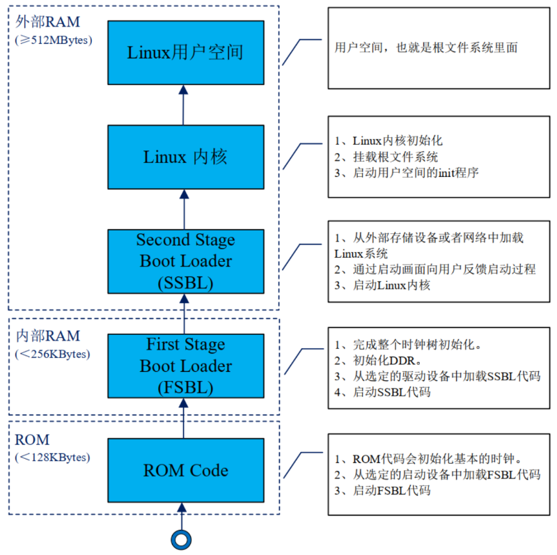

# Linux 基础

ARM Cortex-A7 使用32位指令集和32位地址空间

- 创建目录和子目录

>mkdir -p dir/dir 

- 拷贝

>cp -rfd dir_a dir_b 
d：如果源文件为链接文件，也只是把它作为链接文件复制过去，而不是复制实际文件

- 删除

>rm -rf dir_a 

- chmod：改变文件的权限

>chmod a+w .bashrc
chmod a-x .bashrc 增加或去除某种权限
>**+** 表示添加权限，**-**表示去除权限

tar xf xxx -C dir/xxx 提取文件, (-C 某个目录）

gedit 自带的图形文本编辑器

vi 配置：用户目录下添加 .vimrc文件

# Ubuntu 环境

安装 `git` `vsftpd` ` nfs-kernel-server` `rpcbind` `openssh-server`

可选工具 `neofetch` `ranger` `fzf` `zsh`

设置 *zsh* 为默认 shell

```sh
# 查看版本
zsh --version
# 设为默认
sudo chsh -s $(which zsh)
# 验证
echo $SHELL
```

使用 *wget* 安装 *oh-my-zsh* `sh -c "$(wget -O- https://install.ohmyz.sh/)"`

插件：

>	zsh-autosuggestions： 一个命令提示插件 (apt安装)
>	zsh-syntax-highlighting ： 一个命令语法校验插件 (apt安装)
>	web-search ： 命令行跳转浏览器搜索（自带）

在配置文件 ~/.zshrc 中 找到 **plugins** 添加插件名称，找到 **ZSH_THEME** 修改主题

1. FTP(可选)

> sudo vi /etc/vsftpd.conf

取消注释
> local_enable=YES
> write_enable=YES

2. NFS

打开
> sudo vi /etc/exports

添加
> `/home/zuozhongkai/linux/nfs *(rw,sync,no_root_squash)`

确保目录存在且文件夹有权限

3. tftp

> sudo apt-get install tftp-hpa tftpd-hpa

打开 /etc/default/tftpd-hpa 文件，加入如下内容

```sh
# /etc/default/tftpd-hpa

TFTP_USERNAME="tftp"
TFTP_DIRECTORY="/home/liangwencong/linux/tftpboot"
TFTP_ADDRESS=":69"
TFTP_OPTIONS="-l -c -s"
```


## 安装 交叉编译器

1. [下载地址](https://developer.arm.com/downloads/-/gnu-a) 最下面是旧版的，更旧的版本可能需要百度找了。

2. 在 x86_64 Linux hosted cross compilers 平台下选择 *arm-none-linux-gnueabihf* 编译器 *.tar.xz* 类型的压缩包


3. 下载解压到 */usr/local/arm/* (创建 arm 文件夹)

4. 添加到环境变量

- bash（默认）: 

```sh
# 打开文件
sudo vi /etc/profile
# 文件最后面添加，xxx 为解压后编译器文件夹的名字
export PATH=$PATH:/usr/local/arm/xxx/bin
```

- zsh :

在用户根目录下的 *.zshrc* 配置文件 添加 `export PATH=$PATH:/usr/local/arm/xxx/bin`

验证 `arm-none-linux-gnueabihf-gcc -v`

## VSCode和ST软件安装

1. [下载VSCode](https://code.visualstudio.com/)

下载 *.deb* 后缀的安装包

- 使用 apt 安装：进入下载目录执行 `sudo apt install ./xxx.deb` , xxx为下载的安装包名
- 使用 dpkg 安装 : `sudo dpkg -i xxx.deb`

2. 插件

>C/C++				 	这个肯定是必须的。
>C/C++ Snippets		 	C/C++重用代码块。
>C/C++ Advanced Lint 	C/C++静态检测 。
>Code Runner		 	代码运行。
>Include AutoComplete	自动头文件包含。
>Rainbow Brackets		彩虹花括号，有助于阅读代码。
>One Dark Pro			VSCode 的主题。
>GBKtoUTF8				将 GBK 转换为 UTF8。
>ARM				支持 ARM 汇编语法高亮显示。
>Chinese(Simplified)	中文环境。
>vscode-icons			VSCode 图标插件
>compareit				比较插件，可以用于比较两个文件的差异。
>DeviceTree				设备树语法插件。
>TabNine		一款 AI 自动补全插件，强烈推荐，谁用谁知道！

3. [下载STM32CubeProgrammer](https://www.st.com.cn/zh/development-tools/stm32cubeprog.html)

获取软件选择 'STM32CubePrg-Lin' 需要登录下载，

下载后解压 `unzip xxx.zip` 后运行 `./xxx.linux` 的文件

> 之后还安装了下面的库
> sudo apt-get install libusb-1.0.0-dev

4. USB DFU 以及 STLink 驱动安装

进入 STM32CubeProgrammer 安装路径下的 */Drivers/rules* 
执行 `sudo cp *.rules /etc/udev/rules.d/`
即拷贝 *.rules* 后缀的文件到 */etc/udev/rules.d/*

**验证** 插入 stlink 设备可在 */dev/* 目录下查看


## STM32MP1启动


### 一、安全启动（一般）

1. 首先 ROM 代码从选定的 Flash 设备中加载 FSBL 镜像文件(有头部信息)， FSBL 镜像就是 ROM 加载的第一个用户编写的可执行程序，一般是 TF-A 镜像。

2. FSBL 镜像加载以后需要对其进行鉴权

3. 鉴权成功，那么就会跳转到 FSBL 镜像入口地址，开始运行 FSBL 固件

### 二、串行启动

1. USB 启动

通过 USB OTG 接口来向 STM32MP1 烧写系统

2. UART 启动

通过 UART 烧写系统

### Flash 设备启动要求

	官方的 Flash 分区建议

| 尺寸          | 分区       | 描述      |
|--------------|------------|-----------|
| 256KB~512KB | fsbl     | 第一阶段启动代码，此分区存放 TF-A 或者 uboot 的 SPL 部分，<br> 如果写 A7 裸机例程的话此分区也用来存放裸机代码。 |
| 2MB         | ssbl     | 第二阶段启动代码， 一般是 uboot，如果 uboot 使用设备树的话,<br> 设备树添加到后面。 |
| 64MB        | bootfs   | boot 文件分区，可以存放如下内容：<br> · init ram 文件系统，可以将此文件系统拷贝到 RAM 中，<br> 在 linux 内核挂载正式根文件系统之前可以使用 init ram文件系统。<br> · linux 内核设备树<br> ·    linux 内核<br> · uboot 显示的启动界面<br> · uboot 发行配置文件 extlinux.conf |
| 16MB        | vendorfs | 此分区存放第三方的版权信息，确保它们不会受到任何<br> 开源许可的污染，比如 GPL V3。 |
| 768MB       | rootfs   | linux 根文件系统。 |
| 剩余空间     | userfs   | 用户自行使用的剩余空间 |

### STM23MP1 Linux系统启动过程



1. ROM 代码

> ST 自己编写的代码，ROM 代码作为第一链，首先要对 FSBL 代码进行鉴权，同样的， FSBL 以及后面的每一链都要对下一个阶段的镜像进行鉴权，直到设备系统正确启动。

2. FSBL

> FSBL 代码初始化时钟树、初始化外部 RAM 控制器，也就是 DDR。最终 FSBL 将 SSBL 加载到 DDR 里面并运行 SSBL 代码。
> 一般 FSBL 代码是 TF-A 或者 Uboot 的 SPL 代码，也可以将 FSBL 换成内核裸机代码

3. SSBL

> SSBL 代码运行在 DDR 里面，无需担心空间不够，一般是 Uboot，用来启动 Linux 内核

4. Linux 内核

> Linux 内核启动过程中会初始化板子上的各种外设

5. Linux 用户空间

> 系统启动的时候会通过 init 进程切换到用户空间，在这个过程中会初始化根文件系统里面的各种框架以及服务。

# tf-a

## 准备

下载st提供的STM32MP1 OpenSTLinux开发套件 <https://www.st.com.cn/zh/embedded-software/stm32mp1dev.html>
	里面有Linux内核、U-boot、tf-a

- 打补丁
进到tf-a源码目录执行
```sh
for p in `ls -1 ../*.patch`; do patch -p1 < $p; done
```

- 使用自己的交叉编译器
打开 Makefile.sdk， 找到`CROSS_COMPILE`，将其改为“arm-none-linux-gnueabihf-”


- 编译需要的工具：
[stm32wrapper4dbg](https://github.com/STMicroelectronics/stm32wrapper4dbg/)
`stm32image`

## 移植

### 创建自己的设备树

tf-a源码\fdts 中的

```sh
cp stm32mp157d-ed1.dts stm32mp157d-atk.dts
cp stm32mp15xx-edx.dtsi stm32mp157d-atk.dtsi
```

修改 stm32mp157d-atk.dts 中的 `stm32mp15xx-edx.dtsi` 为 `#include "stm32mp157d-atk.dtsi"`

`TFA_DEVICETREE` 配置项中添加 “stm32mp157d-atk”

### 修改电源管理和 TF 卡、 EMMC 设备树

#### stm32mp157datk.dtsi文件修改:

- 删除 pmic
- 删除vin节点，用下面内容替换

```sh
vddcore: regulator-vddcore {
	compatible = "regulator-fixed";
	regulator-name = "vddcore";
	regulator-min-microvolt = <1200000>;
	regulator-max-microvolt = <1350000>;
	regulator-off-in-suspend;
	regulator-always-on;
};

v3v3: regulator-3p3v {
	compatible = "regulator-fixed";
	regulator-name = "v3v3";
	regulator-min-microvolt = <3300000>;
	regulator-max-microvolt = <3300000>;
	regulator-off-in-suspend;
	regulator-always-on;
};

vdd: regulator-vdd {
	compatible = "regulator-fixed";
	regulator-name = "vdd";
	regulator-min-microvolt = <3300000>;
	regulator-max-microvolt = <3300000>;
	regulator-off-in-suspend;
	regulator-always-on;
};

vdd_usb: regulator-vdd-usb {
	compatible = "regulator-fixed";
	regulator-name = "vdd_usb";
	regulator-min-microvolt = <3300000>;
	regulator-max-microvolt = <3300000>;
	regulator-off-in-suspend;
	regulator-always-on;
};
```

*解释*： 
>	VDDCORE 电源，也就是 STM32MP157 的内核电源，最小为 1.2V，最大为 1.35V。
>	3.3V 电源，最小和最大都是 3.3V
>	VDD 电源，这是一个 3.3V 的电源，所以最小和最大都为 3.3V
>	VDD_USB 电源，为 3.3V，所以最小和最大都为 3.3V

- *sdmmc1* 和 *sdmmc2* 节点 替换：

```sh
&sdmmc1 {
	pinctrl-names = "default";
	pinctrl-0 = <&sdmmc1_b4_pins_a &sdmmc1_dir_pins_a>;
	st,neg-edge;
	broken-cd;
	bus-width = <4>;
	vmmc-supply = <&v3v3>;
	status = "okay";
};

&sdmmc2 {
	pinctrl-names = "default";
	pinctrl-0 = <&sdmmc2_b4_pins_a &sdmmc2_d47_pins_a>;
	non-removable;
	st,neg-edge;
	bus-width = <8>;
	vmmc-supply = <&v3v3>;
	vqmmc-supply = <&v3v3>;
	status = "okay";
};
```

- *usbotg_hs* 节点 替换

```sh
&usbotg_hs {
	phys = <&usbphyc_port1 0>;
	phy-names = "usb2-phy";
	usb-role-switch;
	status = "okay";
};

&usbphyc {
	status = "okay";
};
```

修改完成，编译 `make -f ../Makefile.sdk ` 复制 ../build/trusted 下的 *tf-a-stm32mp157d-atk-trusted.stm32*

## xxx-serialboot.stm32 文件编译

此文件用于 **串行启动** 主要用于初始化 DDR，并且提供 USB 或串口功能，目的是为了进一步将 uboot 镜像下载到 DDR 的指定位置，最终通过 uboot 来向外部 flash 设备烧写整个系统镜像。

打开 Makefile.sdk 将 EXTRA_OEMAKE_SERIAL 改为

```Makefile
EXTRA_OEMAKE_SERIAL=$(filter-out STM32MP_SDMMC=1 STM32MP_EMMC=1 STM32MP_SPI_NOR=1 STM32MP_RAW_NAND=1 STM32MP_SPI_NAND=1,$(EXTRA_OEMAKE)) STM32MP_UART_PROGRAMMER=1 STM32MP_USB_PROGRAMMER=1
```

然后

```sh
make -f ../Makefile.sdk clean
make -f ../Makefile.sdk TFA_DEVICETREE=stm32mp157d-atk TF_A_CONFIG=serialboot ELF_DEBUG_ENABLE='1' all
```

在../build/serialboot 目录下生成

# U-boot

## 准备

安装一些库

```sh
sudo apt-get install libncurses5-dev bison flex
```
修改 uboot 的 Makefile 文件

```Makefile
ifeq ($(HOSTARCH),$(ARCH))
CROSS_COMPILE ?=
endif
# 在此添加下面两句话
ARCH=arm
CROSS_COMPILE=arm-none-linux-gnueabihf- 
```

```sh
# 默认配置
make stm32mp15_trusted_defconfig
# 进入 configs 目录
cd configs
# 拷贝配置文件
cp stm32mp15_trusted_defconfig stm32mp15_atk_trusted_defconfig
```


## 创建默认配置设备树

```sh
# 进入 uboot 设备树目录
cd arch/arm/dts/
cp stm32mp157d-ed1.dts stm32mp157d-atk.dts
cp stm32mp15xx-edx.dtsi stm32mp157d-atk.dtsi
cp stm32mp157a-ed1-u-boot.dtsi stm32mp157d-atk-u-boot.dtsi
```

1. stm32mp157d-atk.dts 文件修改头文件引用 *stm32mp15xx-edx.dtsi* 头文件，将其改为上面创建的 *stm32mp15d-atk.dtsi*
2. stm32mp157d-atk-u-boot.dtsi 文件删除 21~22 行、 26~31 行和 51~53 行

如下面所示

```sh
config {
	u-boot,boot-led = "heartbeat";
	u-boot,error-led = "error";
	u-boot,mmc-env-partition = "ssbl";
x	st,fastboot-gpios = <&gpioa 13 GPIO_ACTIVE_LOW>;
x	st,stm32prog-gpios = <&gpioa 14 GPIO_ACTIVE_LOW>;
};

led {
x	red {
x		label = "error";
x		gpios = <&gpioa 13 GPIO_ACTIVE_LOW>;
x		default-state = "off";
x		status = "okay";
x		};
x	};
};

&pmic {
x	u-boot,dm-pre-reloc;
};
```

3. stm32mp157d-atk.dtsi 文件 adc 节点、 dac 节点、 i2c4 节点、 led 和 sd_switch 节点 全部删除

> 根节点‘/’中的led 和 sd_switch节点替换成下面自己的电源管理配置

```sh
vddcore: regulator-vddcore {
	compatible = "regulator-fixed";
	regulator-name = "vddcore";
	regulator-min-microvolt = <1200000>;
	regulator-max-microvolt = <1350000>;
	regulator-always-on;
	regulator-boot-on;
};
v3v3: regulator-3p3v {
	compatible = "regulator-fixed";
	regulator-name = "v3v3";
	regulator-min-microvolt = <3300000>;
	regulator-max-microvolt = <3300000>;
	regulator-always-on;
	regulator-boot-on;
};

v1v8_audio: regulator-v1v8-audio {
	compatible = "regulator-fixed";
	regulator-name = "v1v8_audio";
	regulator-min-microvolt = <1800000>;
	regulator-max-microvolt = <1800000>;
	regulator-always-on;
	regulator-boot-on;
};

vdd: regulator-vdd {
	compatible = "regulator-fixed";
	regulator-name = "vdd";
	regulator-min-microvolt = <3300000>;
	regulator-max-microvolt = <3300000>;
	regulator-always-on;
	regulator-boot-on;
};

vdd_usb: regulator-vdd-usb {
	compatible = "regulator-fixed";
	regulator-name = "vdd_usb";
	regulator-min-microvolt = <3300000>;
	regulator-max-microvolt = <3300000>;
	regulator-always-on;
	regulator-boot-on;
};
```

4. 修改 TF 卡和 EMMC 配置

```sh
&sdmmc1 {
	pinctrl-names = "default", "opendrain", "sleep";
	pinctrl-0 = <&sdmmc1_b4_pins_a>;
	pinctrl-1 = <&sdmmc1_b4_od_pins_a>;
	pinctrl-2 = <&sdmmc1_b4_sleep_pins_a>;
	st,neg-edge;
	broken-cd;
	bus-width = <4>;
	vmmc-supply = <&v3v3>;
	status = "okay";
};

&sdmmc2 {
	pinctrl-names = "default", "opendrain", "sleep";
	pinctrl-0 = <&sdmmc2_b4_pins_a &sdmmc2_d47_pins_a>;
	pinctrl-1 = <&sdmmc2_b4_od_pins_a &sdmmc2_d47_pins_a>;
	pinctrl-2 = <&sdmmc2_b4_sleep_pins_a &sdmmc2_d47_sleep_pins_a>;
	non-removable;
	st,neg-edge;
	bus-width = <8>;
	vmmc-supply = <&v3v3>;
	keep-power-in-suspend;
	status = "okay";
};
```


### 网络驱动修改

将网络节点添加在文件最后：

```sh
&ethernet0 {
	status = "okay";
	pinctrl-0 = <&ethernet0_rgmii_pins_a>;
	pinctrl-1 = <&ethernet0_rgmii_pins_sleep_a>;
	pinctrl-names = "default", "sleep";
	phy-mode = "rgmii-id";
	max-speed = <1000>;
	phy-handle = <&phy0>;

	mdio0 {
		#address-cells = <1>;
		#size-cells = <0>;
		compatible = "snps,dwmac-mdio";
		phy0: ethernet-phy@0 {
			reg = <0>;
		};
	};
};
```

将正点原子的 1、程序源码 → 8、模块驱动源码 → 1、 YT8511 驱动源码 → uboot 下修改方法 → phy.c 替换掉 uboot 下的/drivers/net/phy/phy.c 文件

打开 *arch/arm/dts/Makefile* 文件，找到 `dtb-$(CONFIG_STM32MP15x)` 配置项， 然后在此配置项中加入 `stm32mp157d-atk.dtb`

```sh
# 编译 u-boot 的命令
make distclean
make stm32mp15_atk_trusted_defconfig
make DEVICE_TREE=stm32mp157d-atk all -j12
```

V=1 表示编译 uboot 的时候输出详细的编译过程
-j 选项来使用多线程编译

```sh
# u-boot 中的网络配置
setenv ipaddr 192.168.1.250 	//开发板 IP 地址
setenv ethaddr 00:04:9f:04:d2:35 //开发板网卡 MAC 地址
setenv gatewayip 192.168.1.1 	//开发板默认网关
setenv netmask 255.255.255.0 	//开发板子网掩码
setenv serverip 192.168.1.249 	//服务器地址，也就是 Ubuntu 地址
saveenv
```

然后 ping ubuntu虚拟机 测试

最后使用 nfs 和 tftp 下载 ubuntu虚拟机文件：
nfs C2000000 192.168.1.249:/home/zuozhongkai/linux/nfs/uImage
tftp C2000000 uImage

### USB OTG 设备树修改

1. 在根节点“/”下添加名为 `usb_phy_tuning` 的子节点

```sh
usb_phy_tuning: usb-phy-tuning {
	st,hs-dc-level = <2>;
	st,fs-rftime-tuning;
	st,hs-rftime-reduction;
	st,hs-current-trim = <15>;
	st,hs-impedance-trim = <1>;
	st,squelch-level = <3>;
	st,hs-rx-offset = <2>;
	st,no-lsfs-sc;
};
```

2. 添加 STUSB1600 I2C 子节点

添加在文件最后

```sh
&i2c1 {
	pinctrl-names = "default", "sleep";
	pinctrl-0 = <&i2c1_pins_a>;
	pinctrl-1 = <&i2c1_pins_sleep_a>;
	i2c-scl-rising-time-ns = <100>;
	i2c-scl-falling-time-ns = <7>;
	status = "okay";
	/delete-property/dmas;
	/delete-property/dma-names;

	stusb1600@28 {
		compatible = "st,stusb1600";
		reg = <0x28>;
		interrupts = <2 IRQ_TYPE_EDGE_FALLING>;
		interrupt-parent = <&gpiog>;
		pinctrl-names = "default";
		pinctrl-0 = <&stusb1600_pins_a>;
		status = "okay";
		vdd-supply = <&vin>;
		connector {
			compatible = "usb-c-connector";
			label = "USB-C";
			power-role = "dual";
			power-opmode = "default";

			port {
				con_usbotg_hs_ep: endpoint {
					remote-endpoint = <&usbotg_hs_ep>;
				};
			};
		};
	};
};
```

3. 添加 usb 接口相关节点

usbotg_hs 默认就有,修改了一下

```sh
&usbh_ehci {
	phys = <&usbphyc_port0>;
	status = "okay";
};

&usbotg_hs {
	phys = <&usbphyc_port1 0>;
	phy-names = "usb2-phy";
	usb-role-switch;
	status = "okay";

	port {
		usbotg_hs_ep: endpoint {
			remote-endpoint = <&con_usbotg_hs_ep>;
		};
	};
};

&usbphyc {
	status = "okay";
};
```

4. 在 *stm32mp157d-atk-u-boot.dtsi* 文件最后添加 `usbotg_hs` 节点

```sh
&usbotg_hs {
	u-boot,force-b-session-valid;
	hnp-srp-disable;
	/* TEMP: force peripheral for USB OTG */
	dr_mode = "peripheral";
};
```

测试 USB OTG 功能，运行 `ums 0 mmc 1` 将 EMMC 模拟成 U 盘


### LCD 驱动修改

stm32mp157d-atk.dts 文件，在里面添加 LCD 相关节点信息，首先在根节点“/”下添加 panel_backlight 和 panel_rgb 节点

```sh
panel_backlight: panel-backlight {
	compatible = "gpio-backlight";
	gpios = <&gpiod 13 GPIO_ACTIVE_HIGH>;
	default-on;
	status = "okay";
};

panel_rgb: panel-rgb {
	compatible = "simple-panel";
	pinctrl-names = "default", "sleep";
	pinctrl-0 = <&ltdc_pins_b>;
	pinctrl-1 = <&ltdc_pins_sleep_b>;
	backlight = <&panel_backlight>;
	status = "okay";

	port {
		panel_in_rgb: endpoint {
			remote-endpoint = <&ltdc_ep0_out>;
		};
	};

	display-timings {
		native-mode = <&timing0>;			/* 时序信息 */
		timing0: timing0 {					/* 7 寸 1024*600 分辨率 */
			clock-frequency = <51200000>;	/* LCD 像素时钟，单位 Hz */
			hactive = <1024>;				/* LCD X 轴像素个数 */
			vactive = <600>;				/* LCD Y 轴像素个数 */
			hfront-porch = <160>;			/* LCD hfp 参数 */
			hback-porch = <140>;			/* LCD hbp 参数 */
			hsync-len = <20>;				/* LCD hspw 参数 */
			vback-porch = <20>;				/* LCD vbp 参数 */
			vfront-porch = <12>;			/* LCD vfp 参数 */
			vsync-len = <3>;				/* LCD vspw 参数 */
		};
	};
};
```

向 ltdc 节点追加一些内容

```sh
&ltdc {
	status = "okay";
	pinctrl-names = "default";
	port {
		#address-cells = <1>;
		#size-cells = <0>;

		ltdc_ep0_out: endpoint@0 {
			reg = <0>;
			remote-endpoint = <&panel_in_rgb>;
		};
	};
};
```

## bootcmd 和

### bootcmd 保存着 uboot 默认命令

uboot 倒计时结束以后就会执行 bootcmd 中的命令。这些命令一般都是用来启动 Linux 内核的，比如读取 EMMC 或者 NAND Flash 中的 Linux 内核镜像文件和设备树文件到 DRAM 中，然后启动 Linux 内核。可以在 uboot 启动以后进入命令行设置 bootcmd 环境变量的值。

如果 EMMC 或者 NAND 中没有保存 bootcmd 的值，那么 uboot 就会使用默认的值，板子第一次运行 uboot 的时候都会使用默认值来设置 bootcmd 环境变量，文件 include/env_default.h有显示，可在stm32mp1.h 文件中通过设置宏
CONFIG_BOOTCOMMAND 来设置 bootcmd 的默认值。

### bootargs 保存着 uboot 传递给 Linux 内核的参数

比如指定 Linux 内核所使用的 console、指定根文件系统所在的分区等，如下面 bootargs 环境变量值：

	console=ttySTM0,115200 root=/dev/mmcblk2p3 rootwait rw

1. console

console 用来设置 linux 终端(或者叫控制台)，也就是通过什么设备来和 Linux 进行交互，是串口还是 LCD 屏幕

如果是串口的话应该是串口几等等。一般设置串口作为 Linux 终端，这样就可以在电脑上通过 MobaXterm 来和 linux 交互了。这里设置 console 为 ttySTM0，因为 linux 启动以后 STM32MP1 的串口 4 在 linux 下的设备文件就是/dev/ttySTM0，在 Linux 下，一切皆文件。

ttySTM0 后面有个“,115200”，这是设置串口的波特率， console=ttySTM0,115200 

综合起来就是设置 ttySTM0（也就是串口 4）作为 Linux 的终端，并且串口波特率设置为 115200。

2. root

root 用来设置根文件系统的位置， root=/dev/mmcblk2p3 用于指明根文件系统存放在mmcblk2 设备的分区 3 中。其中 /dev/mmcblkx(x=0~n) 表 示 mmc 设 备 ， 而 /dev/mmcblkxpy(x=0~n,y=1~n) 表示 mmc 设备 x 的分区 y。在 STM32MP1 开发板中/dev/mmcblk2 表示 EMMC，而/dev/mmcblk2p3 表示 EMMC 的分区 3。

rootwait 表示等待 mmc 设备初始化完成以后再挂载，否则的话 mmc 设备还没初始化完成就挂载根文件系统会出错的。 

rw 表示根文件系统是可以读写的

3. rootfstype

此选项一般配合 root 一起使用， rootfstype 用于指定根文件系统类型，如果根文件系统为 ext 格式的话此选项无所谓。如果根文件系统是 yaffs、 jffs 或 ubifs 的话就需要设置此选项，指
定根文件系统的类型。

bootargs 常设置的选项就这三个

## 图形配置

需要安装 ncurses 库：

	sudo apt-get install build-essential libncurses5-dev

执行

```sh
make stm32mp15_atk_trusted_defconfig
make menuconfig
```

