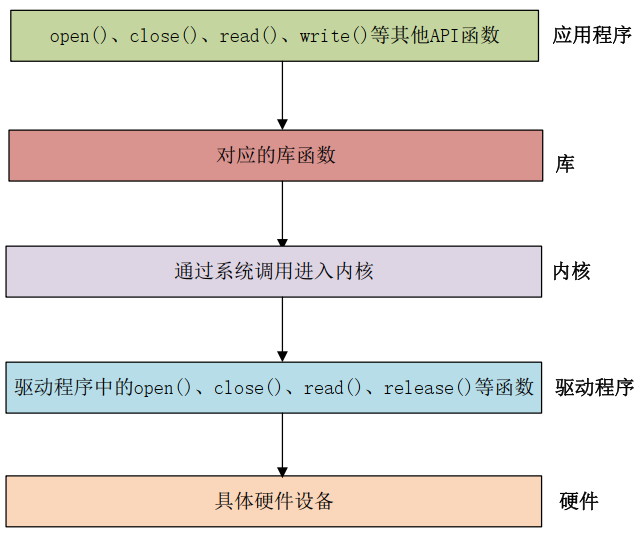

# 基础知识

## 字符设备驱动



驱动加载成功以后会在“/dev”目录下生成一个相应的文件，应用程序通过对这个名为“/dev/xxx” (xxx 是具体的驱动文件名字)的文件进行相应的操作即可实现对硬件的操作。


> Linux 内核驱动操作函数集合： *file_operations* 的结构体，在 Linux 内核文件 *include/linux/fs.h* 中

- *owner* 拥有该结构体的模块的指针，一般设置为 THIS_MODULE。
- *llseek* 函数用于修改文件当前的读写位置。
- *read* 函数用于读取设备文件。
- *write* 函数用于向设备文件写入(发送)数据。
- *poll* 是个轮询函数，用于查询设备是否可以进行非阻塞的读写。
- *unlocked_ioctl* 函数提供对于设备的控制功能，与应用程序中的 ioctl 函数对应。
- *compat_ioctl* 函数与 *unlocked_ioctl* 函数功能一样，区别在于在 64 位系统上，32 位的应用程序调用将会使用此函数。在 32 位的系统上运行 32 位的应用程序调用的是 *unlocked_ioctl*。
- *mmap* 函数用于将将设备的内存映射到进程空间中(也就是用户空间)，一般帧缓冲设备会使用此函数，
	- 比如 LCD 驱动的显存，将帧缓冲(LCD 显存)映射到用户空间中以后应用程序就可以直接操作显存了，这样就不用在用户空间和内核空间之间来回复制。
- *open* 函数用于打开设备文件。
- *release* 函数用于释放(关闭)设备文件，与应用程序中的 close 函数对应。
- *fasync* 函数用于刷新待处理的数据，用于将缓冲区中的数据刷新到磁盘中。


### 开发步骤

1. 加载和卸载

```c
module_init(xxx_init); //注册模块加载函数
module_exit(xxx_exit); //注册模块卸载函数
```

> 使用 *modprobe* 命令加载驱动，调用 xxx_init 函数
> 使用 *rmmod* 命令卸载具体驱动，调用 xxx_exit 函数

*modprobe* 命令默认会去 */lib/modules/<kernel-version>* 目录中查找模块

2. 注册与注销

> 对于字符设备驱动而言，当*驱动模块加载*成功以后需要*注册字符设备*，同样，*卸载驱动模块*的时候也需要*注销掉字符设备*

注册和注销函数原型:

```c
static inline int register_chrdev(unsigned int major,
								const char *name,
								const struct file_operations *fops)
static inline void unregister_chrdev(unsigned int major,
									const char *name)
```

- *major*： **主设备号**， Linux 下每个设备都有一个设备号，设备号分为主设备号和次设备号两部分。
- *name*：**设备名字**，指向一串字符串。
- *fops*： 结构体 file_operations 类型指针，指向设备的**操作函数集合**变量。

需要选择没有被使用的主设备号，输入命令 `cat /proc/devices` 可以查看当前已经被使用掉的设备号

3. 实现设备的具体操作函数

分析一下需求

然后编写了四个函数： chrtest_open、 chrtest_read、chrtest_write 和 chrtest_release。这四个函数就是 chrtest 设备的 open、 read、 write 和 release 操作函数。

4. 添加 LICENSE 和作者信息

例如：

```c
MODULE_LICENSE("GPL");
MODULE_AUTHOR("xemao");
```

### Linux 设备号

为了方便管理， Linux 中每个设备都有一个设备号，设备号由主设备号和次设备号两部分组成

Linux 提供了一个名为 *dev_t* 的数据类型表示设备号， *dev_t* 定义在文件 *include/linux/types.h* 里面

```c
typedef __u32 __kernel_dev_t;
......
typedef __kernel_dev_t dev_t;
```

可以看出 *dev_t* 是 `__u32` 类型的，而 `__u32` 定义在文件 *include/uapi/asm-generic/int-ll64.h* 里面，定义如下：

```c
typedef unsigned int __u32;
```

*dev_t* 其实就是 `unsigned int` 类型，是一个 32 位的数据类型。这 32 位的数据构成了主设备号和次设备号两部分，其中高 12 位为主设备号，低 20 位为次设备号

在文件 *include/linux/kdev_t.h* 中提供了几个关于设备号的操作函数(本质是宏)

```c
#define MINORBITS 20
#define MINORMASK ((1U << MINORBITS) - 1)

#define MAJOR(dev) ((unsigned int) ((dev) >> MINORBITS))
#define MINOR(dev) ((unsigned int) ((dev) & MINORMASK))
#define MKDEV(ma,mi) (((ma) << MINORBITS) | (mi))
```

#### 动态分配设备号

```c
//分配设备号
int alloc_chrdev_region(dev_t *dev, unsigned baseminor, unsigned count, const char *name)
//释放设备号
void unregister_chrdev_region(dev_t from, unsigned count)
```

- *dev*：保存申请到的设备号。
- *baseminor*： 次设备号起始地址， `alloc_chrdev_region` 可以申请一段连续的多个设备号，这些设备号的主设备号一样，但是次设备号不同，次设备号以 baseminor 为起始地址地址开始递增。一般 baseminor 为 0，也就是说次设备号从 0 开始。
- *count*： 要申请的设备号数量
- *name*：设备名字
- *from*：要释放的设备号
- *count*： 表示从 from 开始，要释放的设备号数量

#### 补充

> 在内核中想要向控制台输出或显示一些内容，必须使用printk
> printk 可以根据日志级别对消息进行分类，一共有 8 个消息级别
> 这 8 个消息级别定义在文件 *include/linux/kern_levels.h* 里面

```c
#define KERN_SOH        "\001"
#define KERN_EMERG      KERN_SOH "0" /* 紧急事件，一般是内核崩溃 */
#define KERN_ALERT      KERN_SOH "1" /* 必须立即采取行动 */
#define KERN_CRIT       KERN_SOH "2" /* 临界条件，比如严重的软件或硬件错误*/
#define KERN_ERR        KERN_SOH "3" /* 错误状态，一般设备驱动程序中使用 KERN_ERR 报告硬件错误 */
#define KERN_WARNING    KERN_SOH "4" /* 警告信息，不会对系统造成严重影响 */
#define KERN_NOTICE     KERN_SOH "5" /* 有必要进行提示的一些信息 */
#define KERN_INFO       KERN_SOH "6" /* 提示性的信息 */
#define KERN_DEBUG      KERN_SOH "7" /* 调试信息 */
```

其中 0 的优先级最高， 7 的优先级最低。如果要设置消息级别，参考如下示例：

```c
printk(KERN_EMERG "gsmi: Log Shutdown Reason\n");
```

如果使用 printk 的时候不显式的设置消息级别，那么 printk 将会采用默认级别 `MESSAGE_LOGLEVEL_DEFAULT`

在 *include/linux/printk.h* 中有个宏 `CONSOLE_LOGLEVEL_DEFAULT`


## 新字符设备驱动

## 设备树

## pinctrl和gpio子系统


# Linux 基础知识


## 并发与竞争

## 内核定时器

## 中断

## 阻塞和非阻塞IO

## 异步通知

# 基础知识Ⅱ

## platform

## INPUT子系统

## MISC驱动

# 设备篇

## PWM 设备&子系统

## 内核 RTC 驱动

## I2C 总线框架

## SPI 总线框架

## 串口驱动


## 块设备

## 网络设备驱动

### 有线网络

### 无线 WiFi 驱动

### 4G 通信

# 拓展

## Regmap 子系统

## IIO 驱动

## ADC驱动

## DAC驱动

## 单总线驱动

